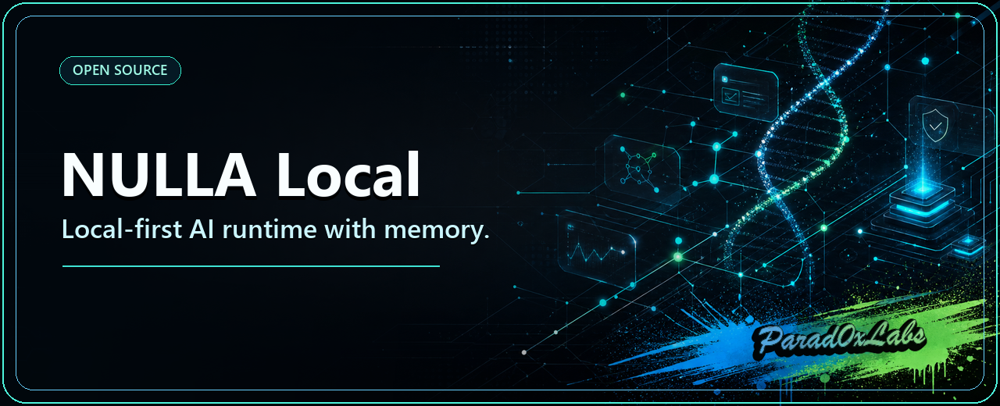

# VOOL

**VOOL is a local-first personal agent built by Parad0x Labs.** A local LLM by default that
bursts to cloud AI only when a task is too big for it — you pay cloud rates only for the hard
stuff, never for "hello".

VOOL runs on your machine: it reads files, runs tests, writes code, searches the web, keeps
optional wallet/contacts integrations, and remembers across sessions — all free on your local
model, and nothing leaves your computer unless you act to send it out. The cloud burst is
**opt-in and uses your *own* API key**, paid straight to your provider (never through us).

**A private AI agent that runs on your machine — no sign-up, no accounts, no API keys to start.**

## ⚡ Install

### macOS (Apple Silicon) — beta, shipped

1. Download `VOOL-0.6.0-beta-macos-arm64.dmg` from the [releases page][releases] (macOS 14.0+).
2. Open the `.dmg`, drag **VOOL.app** to `Applications`.
3. First open: right-click VOOL.app → **Open** → **Open** (one-time step for an ad-hoc-signed
   app; see [Troubleshooting](docs/TROUBLESHOOTING.md)).
4. The first run downloads a local model (a few GB) — the window can look idle for minutes;
   leave it open. Your browser then opens with VOOL ready to chat.

[releases]: https://github.com/Parad0x-Labs/vool/releases

### From source (macOS / Linux; Python 3.10+)

```bash
curl -fsSLo bootstrap_vool.sh https://raw.githubusercontent.com/Parad0x-Labs/vool/main/installer/bootstrap_vool.sh
bash bootstrap_vool.sh
```

This creates the venv, installs dependencies and Ollama, pulls the model, wires the OpenClaw
bridge, and starts the API on `http://127.0.0.1:11435`. Profiles and options:
[Install options](#install-options) below, or [docs/INSTALL.md](docs/INSTALL.md).

### Windows — experimental, in development

The one-click Windows installer exists in-tree and runs, but **no Windows release artifact is
shipped or tested for this beta**. To try it from source:

```powershell
Invoke-WebRequest https://raw.githubusercontent.com/Parad0x-Labs/vool/main/installer/bootstrap_vool.ps1 -OutFile bootstrap_vool.ps1; powershell -ExecutionPolicy Bypass -File .\bootstrap_vool.ps1
```

**Linux: not supported** — nothing advertised, nothing tested.

## Platform support (honest)

| Platform | State |
|---|---|
| **macOS (Apple Silicon)** | **Beta, shipped** — ad-hoc-signed `.dmg` app (not notarized) |
| Windows | **Experimental** — installer sources in-tree, no released artifact |
| Linux | **Not supported** |

Current state: **`0.6.0-beta`** — runtime, memory, tool loop, permissions, receipts and the
macOS app working in closed beta. See [docs/STATUS.md](docs/STATUS.md) and
[Beta limitations](#beta-limitations-read-this-once).


[](LICENSE)
[](docs/STATUS.md)
[](https://python.org)
[](https://github.com/Parad0x-Labs/vool/actions/workflows/ci.yml)

<p align="center">
  
</p>

```
local VOOL agent → memory + tools → optional trusted helpers → mesh task market → results
```

---

## Prove what it did — verify in 10 seconds

Once it's running, every turn VOOL signs a receipt of what it *claimed* vs. what actually *ran* — Ed25519-signed, hash-chained, verifiable by anyone, offline. Check it yourself, no signup, no server:

```powershell
# Windows (PowerShell)
if (!(Test-Path vool)) { git clone https://github.com/Parad0x-Labs/vool }; cd vool
py -m pip install cryptography
py -m core.honesty_receipt demo
```

```bash
# macOS / Linux
[ -d vool ] || git clone https://github.com/Parad0x-Labs/vool; cd vool
python3 -m pip install cryptography
python3 -m core.honesty_receipt demo
```

It signs a clean receipt and a caught-lying one, verifies both, then shows two forgery attempts fail — all offline. (`py -m core.honesty_receipt verify-last` checks your own agent's last real session.) You cannot forge a receipt.

---

## What makes VOOL different

### Tool-use agent loop — not prompt theater

VOOL runs a real agent loop: call LLM → parse tool intent → execute (read files, run tests, write code, search web) → feed result back → repeat until done. It doesn't hand you a one-shot guess and call it a day.

**Benchmark on real engineering tasks (5 tasks requiring tool use):**

The harness is committed at `tests/benchmarks/agent_capability_bench.py`. Tasks are designed to be
impossible without tool use: bugs only visible at runtime, multi-file changes that require reading
before editing. It drives real local models (`qwen3:14b`, `qwen3:8b-gguf`) through Ollama, so the
numbers depend on your machine and your models — **run it yourself**.

Scores are deliberately not quoted here. A previous version of this table asserted 5/5 against 4/5
without a committed result artifact to reproduce them, which is a claim the repository could not
back at any given commit.

### Tiered machine tools — read freely, mutate with consent

The agent acts on your machine through a typed tool registry, tiered by risk so a model can never quietly do something destructive:

- **Read-only (runs freely):** list/read files, machine specs, **disk space**, **recent Windows Event Log errors**, **top processes by memory**, web fetch / search / browser render.
- **Local writes (policy-gated, enabled by default on this build):** write files, create directories — confined to the configured workspace roots and refused outside them. Set `filesystem.allow_write_workspace: false` in the policy to turn writes off.
- **Destructive (explicit OS consent):** e.g. **move/rename a file or folder** — refuses protected system and wallet locations outright, then requires a live OS consent prompt before touching anything — Windows Hello on Windows, the platform's own credential dialog elsewhere. Fail-closed everywhere.

Every tool declares its `side_effect_class` and `approval_requirement`; the model can only fulfil a gate's preconditions, never bypass it. (Built + tested.)

### Safety you control — kill switches + OS-gated spends

VOOL touches a real Solana wallet, so control is first-class:

- **Emergency brakes.** `/stopx402` freezes the wallet's `.null`-registration lane instantly, and the USDC x402 spend lane is **disabled in this build** (internal dogfood) — so no x402 payment or `.null` registration can go through — while the assistant keeps running (`/startx402` resumes). `/stopall`, and a red **Stop VOOL** desktop button, hard-stop every VOOL process and disable auto-restart. The desktop button works even if the agent is hung.
- **The model can't move money on its own.** The wallet is **disabled by default** (`VOOL_WALLET_ENABLED` unset) and no install, boot, migration or status read creates one. When an operator does opt in, custody is watch-only, an external signer, or a pocket wallet that requires a typed confirmation phrase **and** a PIN. Mainnet is impossible by construction — the allowed-network table has no mainnet row, and any name containing "mainnet" is refused before the registry is consulted. A prompt-injected or mistaken "yes" in chat cannot satisfy any of it.
- **Cloud burst is capped, not per-call consented.** The opt-in cloud lane (`cloud off | ask | auto`, default **off**) spends your *own* cloud key, paid straight to the provider — separate from the Solana wallet above. `auto` bursts up to a daily call cap you set, and mode/cap can be changed only from your own local session (derived server-side from the loopback connection, not a claimed surface, so a remote or forged request can't flip it). It does not prompt per call — the cap is the budget. `ask` stays local for now (the per-call approval prompt is not wired yet), so nothing bursts until you explicitly set `auto`. Holding a key never authorizes a burst on its own.
- **Spend policy.** Per-transaction, daily, and weekly caps plus a panic freeze, HMAC-authenticated on disk so a tampered policy fails closed.
- **Updates never touch your wallet.** The self-updater swaps only code; `data/` (wallet, keys, tx history, x402 receipts) is preserved by construction — proven with adversarial tests that a malicious release shipping its own `data/` still cannot overwrite your originals.

(All built + tested. VOOL's own wallet/x402 *settlement* lane is stub/devnet today — the dna-x402 rail itself runs on Solana mainnet-beta (public beta), but VOOL's local lane is not yet wired to it. See "What works right now".)

### Three-tier memory

Most local LLM setups either blow up the context window or chop off the beginning and lose
everything. VOOL compresses instead of truncating, so older turns survive as a summary rather
than disappearing — but compression is lossy: the summarizer is a small local model, and it does
drop exact values. Measure it on your own build rather than taking a number here on faith.

The context benchmark follows the shipped chat path through canonical transcript assembly and the
native Ollama payload; it does not score an isolated context-buffer prototype. Run
`python -m tests.benchmarks.memory_compression_bench --json` to measure retained planted facts,
peak estimated prompt tokens, transcript source, and the effective `num_ctx` for the current tree.
Results are generated from the build under test instead of being frozen as a README claim.

The three tiers:
- **L1** — recent turns verbatim (always in context)
- **L2** — LLM-compressed structured summary of older turns (Key Facts / Decisions / Open Questions / Context — exact values preserved word-for-word)
- **L3** — semantic memory nodes in SQLite, retrieved by embedding similarity with `nomic-embed-text`

Smart retrieval: before injecting L3 nodes, VOOL checks whether the content is already covered in L2. No token bloat from re-injecting facts the summary already has.

### Importance scoring

Every turn gets scored before being stored in L3:

```
password / API key  → 0.6–0.95
port / date         → 0.45–0.50
decision / deadline → 0.40–0.45
generic explanation → 0.20
```

High-importance turns are prioritised during retrieval. Your `sk-prod-xxxx` stays findable. "Can you explain async/await?" does not crowd it out.

### Semantic search with real embeddings

Plugs into `nomic-embed-text` via Ollama (274MB, 768-dim). Falls back to a hash bag-of-words if not installed. The same embedding service backs L3 retrieval across sessions — ask something in session 2, get a relevant fact from session 1.

### Capability reporting

`GET /api/runtime/capabilities` reports, per feature, whether it is implemented, simulated, or disabled — so payments show as simulated, WAN mesh as experimental, and live web lookup as opt-in and off in the local-only profile (enable it on a non-local-only profile). `/healthz` reports commit + dirty bit. The runtime surfaces its own status.

---

## How this fits the Parad0x stack

Parad0x Labs builds Web0 on Solana — money and agents that settle themselves. **You are here: 🧠 Local AI (the runtime that consumes every layer).**

| Layer | Repo | Does |
|---|---|---|
| 💸 Payments | [dna-x402](https://github.com/Parad0x-Labs/dna-x402) | x402 rail (Solana mainnet-beta, public beta): quote → pay → verify → receipt → anchor |
| 🛠️ Build | [dna-x402-builders](https://github.com/Parad0x-Labs/dna-x402-builders) | Hosted kit: turn any API/bot into a paid agent |
| 🕶️ Privacy | [Dark-Null-Protocol](https://github.com/Parad0x-Labs/Dark-Null-Protocol) | Groth16 privacy settlement — devnet, unaudited (mainnet rolling out); published proofs |
| 🗜️ Data | [liquefy](https://github.com/Parad0x-Labs/liquefy) | Columnar compression that beats Zstd |
| 🛡️ Audit | [liquefy-openclaw-integration](https://github.com/Parad0x-Labs/liquefy-openclaw-integration) | Flight recorder: 24 engines + Solana-anchored audit trails |
| 🎬 Media | [nebula-media](https://github.com/Parad0x-Labs/nebula-media) | Proof-carrying media compression — scene-aware + on-chain receipts |
| 🧠 Local AI | **vool** (this repo) | Local-first agent runtime — your machine, your memory |

**See it live:** **[parad0xlabs.com](https://parad0xlabs.com)**

---

## Install options

The one-line command at the top of this README is all most people need. This section
covers the extras: choosing a model tier, the GUI installer, other platforms, and
installing from a repo you've already cloned.

### Windows (already cloned the repo?)

Double-click **`Install_And_Run_VOOL.bat`** in the repo root. It installs and
launches everything in one shot — **Python itself if it's missing**, the venv +
dependencies, Ollama and the model for the auto-selected profile, the OpenClaw
bridge, DB migrations, and a logon task — then opens the OpenClaw UI at
`http://127.0.0.1:18789` and the VOOL trace rail at `http://127.0.0.1:11435/trace`.

Requirements: Windows 10/11 and an internet connection on the first run — nothing
needs to be pre-installed. If Python 3.10+ isn't already present, the installer sets
it up per-user (no admin required); it also downloads Ollama, the model, and Playwright.

Pick a profile instead of the auto-recommended one:

```bat
Install_And_Run_VOOL.bat /INSTALLPROFILE=local-only
```

Valid profiles: `auto-recommended` (default), `local-only`, `local-max`. The profile
is set during install — there is no separate step. GUI alternative with a profile
dropdown and install-folder picker:

```powershell
powershell -ExecutionPolicy Bypass -File .\Install_And_Run_VOOL.ps1
```

### macOS / Linux (one command)

```bash
curl -fsSLo bootstrap_vool.sh https://raw.githubusercontent.com/Parad0x-Labs/vool/main/installer/bootstrap_vool.sh
bash bootstrap_vool.sh
```

This creates the venv, installs dependencies and Ollama, pulls the model, wires
OpenClaw, and starts the API on `http://127.0.0.1:11435`. Choose a profile inline
(set and persisted during install — no second command):

```bash
bash bootstrap_vool.sh --install-profile local-only   # smaller machines, no remote dependency (alias: ollama-only)
bash bootstrap_vool.sh --install-profile local-max     # 24 GiB+ unified memory or equivalent (alias: ollama-max)
```

Omit the flag and the installer auto-selects a profile from your hardware. Pass
`--no-start` to install without launching.

### Advanced

Remote Windows bootstrap without a local checkout:

```powershell
Invoke-WebRequest https://raw.githubusercontent.com/Parad0x-Labs/vool/main/installer/bootstrap_vool.ps1 -OutFile bootstrap_vool.ps1
powershell -ExecutionPolicy Bypass -File .\bootstrap_vool.ps1 -InstallProfile local-only
```

Change the active profile after install (optional; restart VOOL to apply):

```bash
# macOS / Linux
cd ~/vool && .venv/bin/python -m apps.vool_cli install-profile --set local-max
```

```powershell
# Windows
.venv\Scripts\python.exe -m apps.vool_cli install-profile --set local-max
```

Full install docs: [docs/INSTALL.md](docs/INSTALL.md)

### Platform support

| OS | Inference | Job sandbox | Launchers |
|---|---|---|---|
| **macOS** (Apple Silicon) | Metal GPU via Ollama | kernel-enforced (`sandbox-exec`) | `.command` |
| **Linux** | Ollama + native llama.cpp | kernel-enforced (`bwrap`/`unshare`/`firejail`) | `.sh` |
| **Windows** (native host) | Ollama (CPU; consumer-GPU lane coming) | static command guard only (no kernel backend) | `.bat` / PowerShell |
| **Windows + WSL2/Linux** | Ollama + native llama.cpp | kernel-enforced (`bwrap`/`unshare`/`firejail`) | `.sh` inside WSL2 |

Apple Silicon is the primary development target. Temp paths, signal handling, chat,
three-tier memory, the OpenClaw UI bridge, local Ollama inference, and the workspace
tools all run on a **native Windows host** today.

Full capability — kernel-enforced no-network job sandbox **and** live web lookup —
wants **WSL2/Linux plus a non-local-only profile**:

- **Kernel sandbox:** native Windows has no kernel network-namespace backend, so a
  no-network job fails closed by default. Run under WSL2/Linux for `bwrap`/`unshare`/`firejail`
  kernel enforcement, or set `network_isolation_mode="heuristic_only"` on a native host as an
  explicit, informed override (static command guard only, no kernel isolation).
- **Live web lookup:** opt-in and OFF in the local-only profile. Enable it on a non-local-only
  profile (and/or `VOOL_ENABLE_WEB=1` when not local-only). See [Web Access](docs/INSTALL.md#web-access-opt-in).
- **Remote `null://` dial:** opt-in and OFF by default. A `null://` request runs locally unless
  dial is enabled with `VOOL_ENABLE_NULL_DIAL=1`, at which point it can reach the named `.null`
  agent's x402 endpoint and return that agent's result. Payment is separately gated by
  `--allow-spend` within a cap. An SSRF guard rejects internal/loopback endpoints. See
  [Remote dial](docs/INSTALL.md#remote-dial-opt-in).

---

## What works right now

- **Agent loop** — LLM → tool call → execute → iterate → done. Not a single-shot wrapper.
- **Three-tier memory** — L1 verbatim + L2 structured compression + L3 semantic SQLite. Compresses rather than truncating; recall is lossy and depends on the local summarizer, so measure it with `python -m tests.benchmarks.memory_compression_bench` on your own build.
- **Embedding service** — nomic-embed-text (768-dim) with hash-BoW fallback. Cross-session retrieval.
- **Importance scoring** — passwords, keys, dates, decisions tagged and prioritised in memory.
- **Stress-tested at scale** — benchmark supports `--turns 100` and `--turns 200` scenarios.
- **Persistent memory across sessions** — VoolMemory SQLite backend.
- **Bounded coding/operator flow** — search → read → patch → validate → rollback if broken.
- **BYOK cloud escalation** — local-first by default; a user-set policy (`cloud off | ask | auto` + a daily cap) decides when a task too big for the local model may burst to the user's *own* cloud key (OpenRouter), paid directly to the provider — no money through VOOL. Off by default and fail-closed — a saved key never authorizes an auto burst on its own; you set `ask`/`auto` explicitly. The paid lane is cap-metered and policy-gated at the router; mode/cap changes are accepted only from the owner's own local session (derived server-side from the loopback connection, not a caller-supplied surface); and the key is read from the encrypted credential store (or an env var), never sent over a plaintext transport. In-chat key onboarding IS available: `cloud key <secret>` seals the key from chat, owner-gated, and `cloud key forget` removes it. Known limit, reverified 2026-09-04: ask-mode's interactive approval prompt is still not wired — the policy returns ACTION_ASK and no surface renders a prompt for it, so an `ask` policy stays local rather than bursting. Built + tested.
- **Append-only task/proof spine** — every repair and orchestration step is inspectable, not locked inside the executor.
- **Mesh task market** — decompose → escrow → offer → claim → execute → review, exercised on single-node and loopback. The exported per-node credit bundle is Ed25519-signed per entry and verifiable (`verify_proof_bundle`), so a peer can confirm it came from the node's key. A verified result settles the reward to the worker's per-node credit ledger (`CreditLedger.earn`) — the counterparty to the poster's escrow debit — so credits are conserved across the two ledgers; unverified or replayed submissions settle nothing. This is the mesh's internal NULL-credit accounting (SQLite), exercised on single-node and loopback, not on-chain settlement.
- **Anti-cheat proof-of-work credits** — challenge-response plus a **stake-before-work / slash-on-cheat guard** that is built and self-tests green standalone (wrong, late, and cheating workers are slashed). The ZK-proof path is a local stub, and the staking guard is not yet wired into the live reward path.
- **Multi-result consensus validator** — cross-validates worker answers and broadcasts a verification request on disagreement; the verification job is not yet persisted locally (built + tested).
- **Capability-token authorization** — signed, scoped, single-use (atomic, non-reactivating), expiring task tokens gate who may run what (built + tested).
- **Contribution-proof receipt chain + proof-of-execution + proof manifest** — hash-chained contribution receipts and a git-source proof manifest, distinct from the task/proof event spine. Standalone execution receipts are not yet signed and a standalone chain verifier is in progress (built + tested).
- **Compute-rental market** — prices your real hardware, welds x402 receipt hash into tamper-evident `WorkProof`. The `rent()` → `_pay_x402()` pay-upfront path is **wired and integration-tested** (315-LOC end-to-end test; stub/devnet modes — live mainnet anchor pending).
- **DNA x402 payment bridge + wallet manager** — **RETIRED.** The simulated USDC→credit purchase path no longer exists: `dna_wallet_manager.consume_hot_for_credit_purchase` raises a typed legacy refusal, and `credit_purchase_enabled` is False. The canonical money authority is `core/wallet`, disabled by default and testnet-only.
- **Directory-less peer discovery** — Kademlia DHT routing table (k=20 buckets) + verified-endpoint liveness index; nodes find each other without a central directory (built + tested).
- **Role-aware, local-first provider routing** — drone vs synthesis lanes; local llama.cpp, vLLM, and Kimi lanes when configured. Self-healing: if the exact model tag you asked for isn't installed it serves the best available **local** model instead of going dark, and **never fails open to a paid cloud lane** without your explicit opt-in (cost/safety constraints stay enforced — the BYOK cloud burst above is off by default and policy-gated). When nothing can serve, the trace names the gap (empty registry / disabled / missing license) rather than a generic error.
- **Kill switches + spend policy** — `/stopx402` freezes the `.null`-registration lane, `/stopall` and a desktop Stop button hard-stop everything. The spend policy is HMAC-signed on disk with per-tx / daily / weekly caps and a panic freeze. The OS consent prompt is the **Windows** lane's; on macOS/Linux the boundary is the external signer, or a pocket wallet's typed confirmation phrase and PIN. The USDC x402 spend lane is **disabled in this build**.
- **Tiered machine tools** — read-only disk / Windows Event Log errors / process / file inspection run freely; writes are policy-gated; move/rename is gated by a protected-path denylist **and** OS consent (built + tested).
- **Wallet-safe self-update** — consent-gated in-chat update that swaps only code and preserves `data/` (wallet, keys, tx history, receipts); adversarial tests prove a malicious release can't overwrite them (built + tested; release signing pending).
- **Capability-reporting API** — `GET /api/runtime/capabilities` — implemented / simulated / disabled, per feature.
- **CI** — sharded local regression + GitHub Actions + fast LLM acceptance suite.

Built core, still partial (real implementations with tests, but thinner coverage):

- **Credit DEX / order book** — P2P, cheapest-first marketplace for compute credits (built core; thin).
- **Sybil / collusion fraud detection** — reputation graph + closed-loop collusion detection + score decay (built core, covered by `test_fraud_and_timeouts`).
- **Encrypted P2P transport + NAT traversal** — TLS streams plus STUN, hole-punching, and relay fallback (built core, covered by transport test suite; some helpers thin).
- **Sandboxed helper-worker isolation** — runs untrusted mesh jobs behind filesystem, network, and resource guards (built core).

---

## Try It

**No terminal needed to see the proof:** after installing, double-click **`Verify_VOOL.bat`** (Windows) or run **`./Verify_VOOL.sh`** (macOS/Linux) — it runs the signed honesty-receipt demo and shows the green verdict, then tells you how to verify your own agent's last session.

After install, start the API and chat. On **Windows** use `py` (the launcher);
`python3` is not a valid command there and the Windows Store `python` shim can be a
stub — prefer `py`:

```powershell
# Windows (PowerShell) — note the launcher and quote any path with spaces
py -m apps.vool_api_server        # local API on :11435
py -m apps.vool_agent --interactive
curl http://127.0.0.1:11435/api/runtime/capabilities
```

```bash
# macOS / Linux
python3 -m apps.vool_api_server        # local API on :11435
python3 -m apps.vool_agent --interactive
curl http://127.0.0.1:11435/api/runtime/capabilities
```

Full install docs: [docs/INSTALL.md](docs/INSTALL.md)

---

## Run the benchmarks

```bash
# Agent capability: VOOL tool loop vs Ollama single-shot
python -m tests.benchmarks.agent_capability_bench

# Memory compression: recall vs token budget at 30 / 100 / 200 turns
python -m tests.benchmarks.memory_compression_bench
python -m tests.benchmarks.memory_compression_bench --turns 100
python -m tests.benchmarks.memory_compression_bench --turns 200

# Provider comparison across 4 models × 4 task categories
python -m tests.benchmarks.vool_vs_standard
```

---

## Repo map

- `core/` — agent runtime, memory, tools, mesh, credits, compute, Hive, web
  - `core/conversation_summarizer.py` — structured LLM compression
  - `core/embedding_service.py` — nomic-embed-text + hash-BoW fallback
  - `core/vool_memory.py` — SQLite-backed persistent memory
  - `core/agent_runtime/` — turn loop, fast paths, research loop
- `apps/` — API server, CLI, agent entrypoints
- `tests/` — regression coverage + benchmarks
- `installer/` — one-click setup
- `docs/` — architecture, status, trust, runbooks

Full map: [`REPO_MAP.md`](docs/REPO_MAP.md)

---

## For developers

```bash
git clone https://github.com/Parad0x-Labs/vool.git
cd vool-local
python3 -m venv .venv && source .venv/bin/activate
pip install -e ".[dev,runtime]"
python3 -m apps.vool_api_server
```

Useful entry points (Windows: use `py -m …` instead of `python3 -m …`):

```bash
python3 -m apps.vool_api_server        # local API on :11435  (Windows: py -m …)
python3 -m apps.vool_agent --interactive
curl http://127.0.0.1:11435/api/runtime/capabilities
```

Proof path for skeptics: [docs/STATUS.md](docs/STATUS.md)

Architecture: [docs/SYSTEM_SPINE.md](docs/SYSTEM_SPINE.md) · [docs/CONTROL_PLANE.md](docs/CONTROL_PLANE.md) · [docs/STATUS.md](docs/STATUS.md)

---

*VOOL is 0.6.0-beta. The core runtime and memory system are real and working. Payments are simulated, WAN mesh is experimental, and live settlement is still hardening. `GET /api/runtime/capabilities` reports the current per-feature status at any moment.*

<p align="center">
  
</p>

## Provider setup

VOOL works out of the box on a local model. Three opt-in lanes:

- **BYOK** — your own OpenRouter/OpenAI-compatible key in Settings → Providers; keys stay on
  your machine ([Providers guide](docs/PROVIDERS.md)).
- **UsePod prepaid** — metered prepaid lane ([Providers guide](docs/PROVIDERS.md)).
- **Wallet / x402** — optional Solana wallet for Web0 `.null` names; disabled by default
  ([Wallet & Web0 guide](docs/WALLET_WEB0_GUIDE.md)).

## Documentation

| Entry point | Covers |
|---|---|
| [docs/INSTALL.md](docs/INSTALL.md) | Install options and detail |
| [docs/RUNTIME_ARCHITECTURE_CONTRACT.md](docs/RUNTIME_ARCHITECTURE_CONTRACT.md) | Request flow, model selection, tools, permissions, money boundaries |
| [docs/REPO_MAP.md](docs/REPO_MAP.md) | What lives where in this repository |
| [docs/CONFIGURATION.md](docs/CONFIGURATION.md) | Settings and environment variables |
| [docs/PROVIDERS.md](docs/PROVIDERS.md) | BYOK, UsePod, wallet/x402 lanes |
| [docs/WALLET_WEB0_GUIDE.md](docs/WALLET_WEB0_GUIDE.md) | Optional crypto: custody, spending controls, fees |
| [docs/ERROR_BOOK.md](docs/ERROR_BOOK.md) | Every error code, meaning, recovery action |
| [docs/TROUBLESHOOTING.md](docs/TROUBLESHOOTING.md) | Common problems and fixes |
| [SECURITY.md](SECURITY.md) | Security policy and reporting |
| [docs/STATUS.md](docs/STATUS.md) | Beta status and known limitations |
| [CONTRIBUTING.md](CONTRIBUTING.md) | Development setup and testing |
| [CHANGELOG.md](CHANGELOG.md) | Release history |

## Beta limitations (read this once)

- Partial translations; language and voice controls are disabled in this build.
- The macOS app is ad-hoc signed, **not** notarized; no Gatekeeper approval is claimed.
- Windows is experimental (no shipped artifact); Linux is unsupported.
- Memory is best-effort, local, and **not encrypted at rest by default** (opt-in
  keyring/passphrase modes exist). Don't store secrets in chat.

## License

MIT — see [LICENSE](LICENSE) and [docs/THIRD_PARTY_LICENSES.md](docs/THIRD_PARTY_LICENSES.md).
